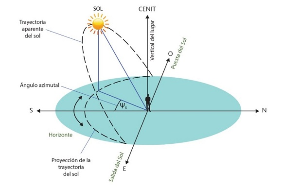
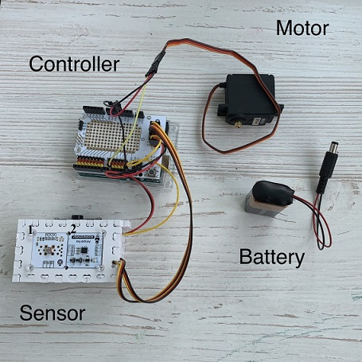

# Solar Tracker
The project has been created during education in [LUT University](https://www.lut.fi/ "LUT") to help the company to gain the maximum energy from the sun. That was the real case with a company that has a partnership with the university. The whole project was created by a team of 4 people, personally, I was responsible for the technical launch of the project, other team members were responsible for theoretical and business parts. 

## Table of Contents  
[Task](#Task)  
[Solution](#Solution)  
[Results](#Results)  

## ⚒️ Client task:
<a name="Task"/>
... And we want to incorporate a new script based in AI/machine learning that identifies objects blocking the sun and calculates how much time is blocking the sun, because if so, we can avoid that period for the calculation of energy we absorb with the solar panel and change the position of the panel to maximize the energy gathered.

## 💡 Idea of possible solution:
<a name="Solution"/>
The solar panel will generate the maximum amount of energy if it receives the maximum luminous flux. Maximum luminous flux can be obtained by turning the solar panel as perpendicular to the sun as possible so that the light covers the maximum surface of the solar panel. To determine a comfortable position of the sun, a rotary light sensor is needed, which will collect information in real time. The idea is to create this one axe solar tracker prototype that calculates the maximum amount of energy from the lighting object and then rotates itself in that superposition. For that purpose cheap Arduino hardware and open sourse Espruino Web IDE was used to complete the project. 

## Result
<a name="Results"/>
As a result, the new device was created with a total cost of €75.78, which is shown in the picture below.

[click on the link to see how it works (YouTube)](https://youtu.be/QEnpQpWs0Wg "Solar Tracker")

 
