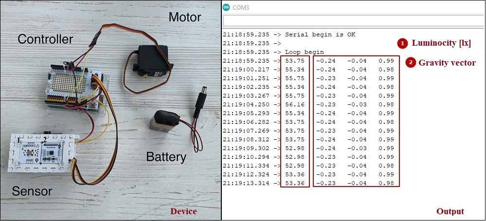

# Solar Tracker
The project has been created during education in [LUT University](https://www.lut.fi/ "LUT") to help the company to gain the maximum energy from the sun. That was the real case with a company that has a partnership with the university. The whole project was created by a team of 4 people, personally, I was responsible for the technical launch of the project, other team members were responsible for theoretical and business parts. 

## Table of Contents  
[Task](#Task)  
[Solution](#Solution)  
[Results](#Results)  

## ⚒️ **Client task:**
<a name="Task"/>
>***... And we want to incorporate a new script based in AI/machine learning that identifies objects
blocking the sun and calculates how much time is blocking the sun, because if so, we can avoid
that period for the calculation of energy we absorb with the solar panel and change the position of
the panel to maximize the energy gathered.***

💡 
## **Idea of possible solution:** 
<a name="Solution"/>
Develop one axe solar tracker prototype that calculates the maximum amount of energy from the lighting object and then rotates in that superposition.

🧰
**Tools that can be used:** 
Arduino platform + sensors (electronics), Espruino Web IDE and C++ Script

## Result
<a name="Results"/>

[click on YouTube video how it works](https://youtu.be/QEnpQpWs0Wg "Solar Tracker")

 
